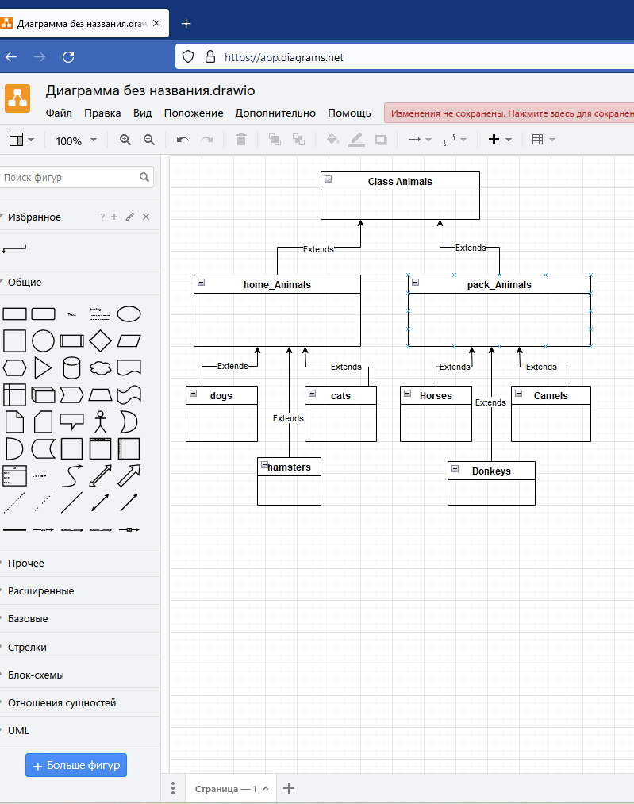
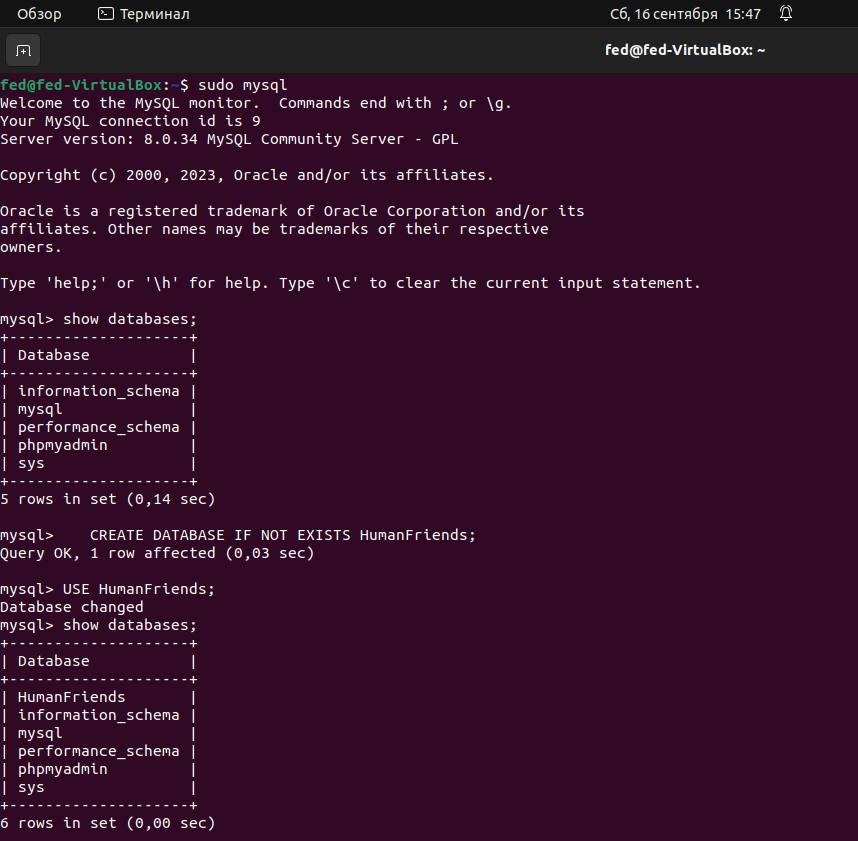
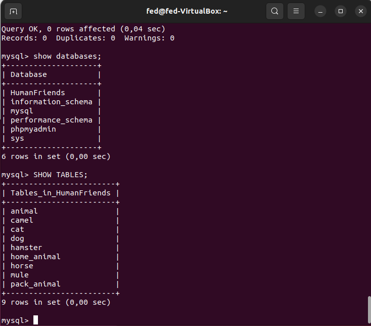
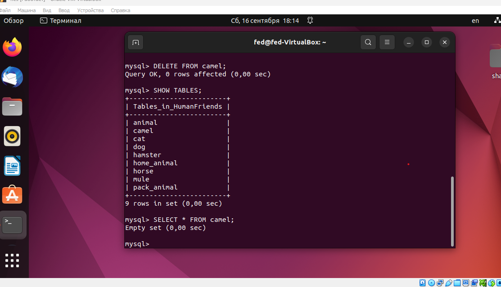

Итоговая контрольная работа

Задание
1. Используя команду cat в терминале операционной системы Linux, создать
два файла Домашние животные (заполнив файл собаками, кошками,
хомяками) и Вьючные животными заполнив файл Лошадьми, верблюдами и
ослы), а затем объединить их. Просмотреть содержимое созданного файла.
Переименовать файл, дав ему новое имя (Друзья человека).
2. Создать директорию, переместить файл туда.
3. Подключить дополнительный репозиторий MySQL. Установить любой пакет
из этого репозитория.
4. Установить и удалить deb-пакет с помощью dpkg.
5. Выложить историю команд в терминале ubuntu

  499  mkdir Pets

  500  cd /Pets/

  501  cd /Pets

  502  ls -la

  503  cd ~/Pets

  504  cat > home_animals

  505  cat > pack_animals

  506  ls -la

  507  cat home_animals pack_animals > animals 

  508  cat animals

  509  ls -la

  510  mv animals mans_friends

  511  ls -ls

  512  ls -ali

  514  cd 

  515  mkdir Pets_sys

  516  cd ~/Pets

  517  mv mans_friends ~/Pets_sys

  518  cd ~/Pets_sys

  519  ls -ali

  520  sudo wget https://dev.mysql.com/get/mysql-apt-config_0.8.24-1_all.deb

  522  sudo dpkg -i mysql-apt-config_0.8.24-1_all.deb

  523  sudo apt-get update

  524  sudo apt-get install mysql-server

  525  sudo wget https://download.docker.com/linux/ubuntu/dists/jammy/pool/stable/amd64/docker-ce-cli_20.10.13~3-0~ubuntu-jammy_amd64.deb

  527  sudo dpkg -i docker-ce-cli_20.10.13~3-0~ubuntu-jammy_amd64.deb

  528  sudo dpkg -r docker-ce-cli

  529  history

6. Нарисовать диаграмму, в которой есть класс родительский класс, домашние
животные и вьючные животные, в составы которых в случае домашних
животных войдут классы: собаки, кошки, хомяки, а в класс вьючные животные
войдут: Лошади, верблюды и ослы.

7. В подключенном MySQL репозитории создать базу данных “Друзья
человека”

8. Создать таблицы с иерархией из диаграммы в БД

CREATE TABLE `animal`
(
  `id` Int NOT NULL AUTO_INCREMENT,
  `animal_name` Varchar(20) NOT NULL,
  PRIMARY KEY (`id`)
)
;

CREATE TABLE `home_animal`
(
  `id` Int NOT NULL AUTO_INCREMENT,
  `home_name` Varchar(20) NOT NULL,
  `livePlace` Varchar(20),
  `id_animal` Int,
  PRIMARY KEY (`id`)
)
;

CREATE INDEX `animal_home` ON `home_animal` (`id_animal`)
;

CREATE TABLE `cat`
(
  `id` Int NOT NULL AUTO_INCREMENT,
  `cat_name` Varchar(30) NOT NULL,
  `date_birth` Date NOT NULL,
  `commands` Varchar(200),
  `color` Varchar(20),
  `id_home` Int,
  PRIMARY KEY (`id`)
)
;

CREATE INDEX `home_cat` ON `cat` (`id_home`)
;

CREATE TABLE `dog`
(
  `id` Int NOT NULL AUTO_INCREMENT,
  `dog_name` Varchar(30) NOT NULL,
  `date_birth` Date NOT NULL,
  `commands` Varchar(200),
  `color` Varchar(20),
  `id_home` Int,
  PRIMARY KEY (`id`)
)
;

CREATE INDEX `home_dog` ON `dog` (`id_home`)
;

CREATE TABLE `hamster`
(
  `id` Int NOT NULL AUTO_INCREMENT,
  `hamster_name` Varchar(30) NOT NULL,
  `date_birth` Date NOT NULL,
  `commands` Varchar(200),
  `color` Varchar(20),
  `id_home` Int,
  PRIMARY KEY (`id`)
)
;

CREATE INDEX `home_hamster` ON `hamster` (`id_home`)
;

CREATE TABLE `pack_animal`
(
  `id` Int NOT NULL AUTO_INCREMENT,
  `pack_name` Varchar(20) NOT NULL,
  `livePlace` Varchar(20),
  `id_animal` Int,
  PRIMARY KEY (`id`)
)
;

CREATE INDEX `animal_pack` ON `pack_animal` (`id_animal`)
;

CREATE TABLE `camel`
(
  `id` Int NOT NULL AUTO_INCREMENT,
  `name` Varchar(30) NOT NULL,
  `date_birth` Date NOT NULL,
  `commands` Varchar(200),
  `color` Varchar(20),
  `id_pack` Int,
  PRIMARY KEY (`id`)
)
;

CREATE INDEX `pack_camel` ON `camel` (`id_pack`)
;

CREATE TABLE `horse`
(
  `id` Int NOT NULL AUTO_INCREMENT,
  `name` Varchar(30) NOT NULL,
  `date_birth` Date NOT NULL,
  `commands` Varchar(200),
  `color` Varchar(20),
  `id_pack` Int,
  PRIMARY KEY (`id`)
)
;

CREATE INDEX `pack_hourse` ON `horse` (`id_pack`)
;

CREATE TABLE `mule`
(
  `id` Int NOT NULL AUTO_INCREMENT,
  `name` Varchar(30) NOT NULL,
  `date_birth` Date NOT NULL,
  `commands` Varchar(200),
  `color` Varchar(20),
  `id_pack` Int,
  PRIMARY KEY (`id`)
)
;

CREATE INDEX `pack_mule` ON `mule` (`id_pack`)
;

9. Заполнить низкоуровневые таблицы именами(животных), командами
которые они выполняют и датами рождения
10. Удалив из таблицы верблюдов, т.к. верблюдов решили перевезти в другой
питомник на зимовку. Объединить таблицы лошади, и ослы в одну таблицу.

11.Создать новую таблицу “молодые животные” в которую попадут все
животные старше 1 года, но младше 3 лет и в отдельном столбце с точностью
до месяца подсчитать возраст животных в новой таблице

CREATE TABLE young_animal (
id int NOT NULL,
name varchar(50),
date_birth Datetime,
commands varchar(200),
color varchar(20),
age varchar(50));

INSERT INTO young_animal (id, name, date_birth, commands, color, age)
SELECT id, cat_name, date_birth, commands, color,
CONCAT(CAST(TIMESTAMPDIFF(YEAR, date_birth, NOW()) AS CHAR), " лет ", 
CAST(MOD(TIMESTAMPDIFF(MONTH, date_birth, NOW()), 12)  AS CHAR), " мес.") AS age 
FROM cat
WHERE TIMESTAMPDIFF(MONTH, date_birth, NOW()) BETWEEN 12 AND 36; 

INSERT INTO young_animal (id, name, date_birth, commands, color, age)
SELECT id, dog_name, date_birth, commands, color,
CONCAT(CAST(TIMESTAMPDIFF(YEAR, date_birth, NOW()) AS CHAR), " лет ", 
CAST(MOD(TIMESTAMPDIFF(MONTH, date_birth, NOW()), 12)  AS CHAR), " мес.") AS age 
FROM dog
WHERE TIMESTAMPDIFF(MONTH, date_birth, NOW()) BETWEEN 12 AND 36; 

INSERT INTO young_animal (id, name, date_birth, commands, color, age)
SELECT id, name, date_birth, commands, color,
CONCAT(CAST(TIMESTAMPDIFF(YEAR, date_birth, NOW()) AS CHAR), " лет ", 
CAST(MOD(TIMESTAMPDIFF(MONTH, date_birth, NOW()), 12)  AS CHAR), " мес.") AS age 
FROM horse
WHERE TIMESTAMPDIFF(MONTH, date_birth, NOW()) BETWEEN 12 AND 36 
UNION ALL
SELECT id, name, date_birth, commands, color,
CONCAT(CAST(TIMESTAMPDIFF(YEAR, date_birth, NOW()) AS CHAR), " лет ", 
CAST(MOD(TIMESTAMPDIFF(MONTH, date_birth, NOW()), 12)  AS CHAR), " мес.") AS age 
FROM mule
WHERE TIMESTAMPDIFF(MONTH, date_birth, NOW()) BETWEEN 12 AND 36;

12. Объединить все таблицы в одну, при этом сохраняя поля, указывающие на
прошлую принадлежность к старым таблицам.

SELECT * FROM (SELECT id, cat_name, dog_name, NULL as hamster_name, NULL as name, date_birth, commands, color FROM (
SELECT id, cat_name, NULL as dog_name, NULL AS hamster_name, NULL AS name, date_birth, commands, color FROM cat
UNION all 
SELECT id, NULL as cat_name, dog_name, NULL AS hamster_name, NULL AS name, date_birth, commands, color FROM dog) A
UNION ALL
SELECT id, NULL as cat_name, NULL as dog_name, hamster_name, NULL AS name, date_birth, commands, color FROM hamster) B
UNION ALL 
SELECT * FROM (
SELECT id, NULL AS cat_name, NULL AS dog_name, NULL AS hamster_name, name, date_birth, commands, color FROM horse
UNION ALL 
SELECT id, NULL AS cat_name, NULL AS dog_name, NULL AS hamster_name, name, date_birth, commands, color FROM mule 
) C;

13.Создать класс с Инкапсуляцией методов и наследованием по диаграмме.

14. Написать программу, имитирующую работу реестра домашних животных.
В программе должен быть реализован следующий функционал:
14.1 Завести новое животное
14.2 определять животное в правильный класс
14.3 увидеть список команд, которое выполняет животное
14.4 обучить животное новым командам
14.5 Реализовать навигацию по меню
15.Создайте класс Счетчик, у которого есть метод add(), увеличивающий̆
значение внутренней̆ int переменной̆ на 1 при нажатие “Завести новое
животное” Сделайте так, чтобы с объектом такого типа можно было работать в
блоке try-with-resources. Нужно бросить исключение, если работа с объектом
типа счетчик была не в ресурсном try и/или ресурс остался открыт. Значение
считать в ресурсе try, если при заведения животного заполнены все поля.

